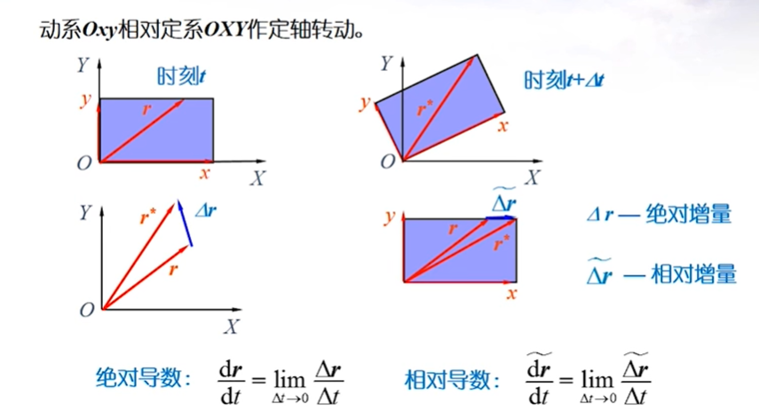
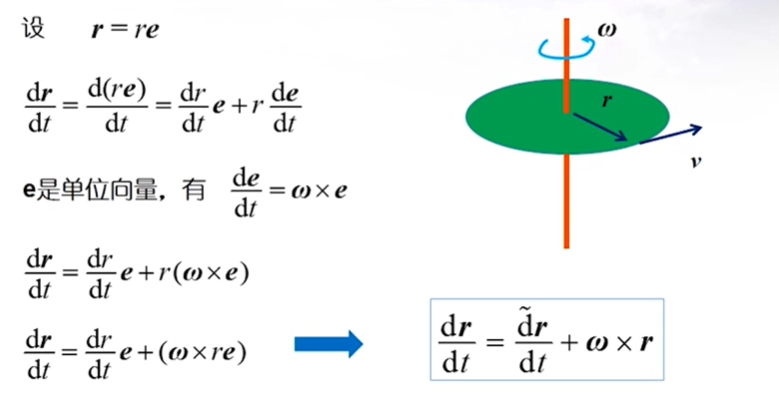

# 导航的背景

- 导航
	- 运动物体随时间变化的位置和**姿态**
- 导航状态
	- 位置，速度和姿态（PVA)
- 导航器件 + 算法 = 导航系统
- 导航原理
	- 航位推算
		- 惯性导航
	- 直接定位
		- GPS

# 惯性导航和惯性器件

## 惯性空间与牛顿运动定律

## 惯性传感器

### 加速度计

#### 定义

一种用于测量相对于**惯性参考系**的加速度（比力）的传感器。

#### 公式

$$
\vec{f} = \vec{a} - \vec{g}
$$

其中

- $\vec{f}$ ：加速计输出[(比力)](https://zhuanlan.zhihu.com/p/157285619)
- $\vec{a}$：相对于惯性空间的运动加速度
- $\vec{g}$ ：万有引力加速度
- 单位：$m/s^2$, $1mGal = 10^{-5} m/s^2$

### 补充

说明：本节会补充比力方程，以及涉及它的相关定理等等。

#### 哥氏定理

##### 坐标系定义

研究合成运动问题，一般会涉及**两个坐标系**。

其中一个坐标系定义为动坐标系，以$Ox'y'z'$ 表示，另外一个称为静坐标系或定坐标系，以$Oxyz$表示。

> 例如：可以将固结在船上的参考坐标系叫动坐标系，固结在地球表面的参考坐标系叫静坐标系，在船上的人称为动点。可见**动静坐标系的定义可以按照自己的意愿来，但是建议按照常识来。**

##### 运动与速度

- 绝对运动：动点相对于静坐标系的运动
- 相对运动：动点相对于动坐标系的运动
- 牵连运动：动坐标系相对于静坐标系的运动

- 绝对速度：动点相对于静坐标系运动的速度，记为$v_\alpha$
- 相对速度：动点相对于动坐标系运动的速度，记为$v_r$

- 牵连点：在任意瞬时与动点相**重合**的**动坐标系**上的点
> 动点和牵连点是一对**相伴点**(不是同一个点)，在运动的同一瞬时，它们是重合在一起的。前者是与动坐标系有相对运动的点，后者则是动坐标系上的几何点。在运动的不同瞬时，动点与动坐标系上不同的点重合
- 牵连速度：某瞬时牵连点相对于静坐标系运动的速度，记为$v_e$

**注意**：这里有一个认知错误，就是以为牵连点和动点重合，那么动点和牵连点相对于静坐标系的运动应该是一样的。但是需要注意的是，**在运动的不同瞬时**，**动点与动坐标系上不同的点重合**。也就是说，牵连点和动点作为不同的点，他们的运动是不一样的。如果是一样的，那么牵连点应该得一直是同一个几何点。

##### 点的合成定理

$$
v_\alpha = v_r + v_e
$$

即动点的绝对速度等于它的牵连速度与相对速度的矢量和。

##### 加速度

- 绝对加速度：动点相对于静坐标系运动的加速度，记为$a_\alpha$
- 相对加速度：动点相对于动坐标系运动的加速度，记为$a_r$
- 牵连加速度：某瞬时牵连点相对于静坐标系运动的加速度，记为$a_e$

角速度：$\omega = \frac{d \varphi}{dt}$
求导后得角加速度：$\varepsilon = \frac{d\omega}{dt}$
代入线速度：$v = \omega \times r$
得：

$$
\begin{eqnarray}
a &=& \frac{dv}{dt} \\
 &=&  \frac{d}{dt}(\omega \times r) \\
 &=&  \frac{d\omega}{dt} \times r + \omega \times \frac{dr}{dt} \\
 &=&  \varepsilon \times r + \omega \times v
\end{eqnarray}
$$

则

- 切向加速度：$a_r = \varepsilon \times r$
- 法向加速度：$a_n = \omega \times v$

##### 矢量的绝对导数和相对导数

##### 当动坐标系作平移

$$
\begin{eqnarray}
v_e = v_{o'} \\
a_e = a_{o'}
\end{eqnarray}
$$

点的速度合成定理：

$$
v_\alpha = v_r + v_e
$$

点的加速度合成定理：

$$
a_\alpha = a_r + a_e
$$

##### 当动坐标系做定轴转动

$$
\begin{eqnarray}
v_e &=& \omega \times r \\
a_e &=& \varepsilon \times r + \omega \times v_e = \varepsilon \times r + \omega \times (\omega \times r)
\end{eqnarray}
$$

点的速度合成定理：

$$
v_\alpha = v_r + v_e = v_r + \omega \times r
$$

点的加速度合成定理：

$$
a_\alpha = a_r + a_e + a_k
$$

其中：

- 科里奥利加速度：$a_k = 2\omega \times v_r$
- 科里奥利力（科氏力）：$F_k = -ma_k = -2m\omega \times v_r$

推导过程如下：

对点的速度合成定理求一阶导数：

$$
a_\alpha=\frac{d v_r}{d t}+\frac{d \omega}{d t} \times r+\omega \times \frac{d r}{d t}
$$

由：

$$
\begin{eqnarray}
\omega \times \frac{d r}{d t} &=& \omega \times\left(\frac{\tilde{dr}}{dt}+\omega \times r\right)\\
&=& \omega \times (v_r + \omega \times r)\\
&=& \omega \times v_r+\omega \times(\omega \times r) \\
\end{eqnarray}
$$

$$
\begin{eqnarray}
\frac{dv_r}{dt} &=& \frac{\tilde{dv_r}}{dt} + \omega \times v_r \\
&=& a_r + \omega \times v_r
\end{eqnarray}
$$

其中需要**注意**的是：

$$
\begin{eqnarray}
\frac{\tilde{dr}}{dt} &=& v_r \\
\frac{\tilde{dv_r}}{dt} &=& a_r \\
\end{eqnarray}
$$

> 因为头上带波浪线的是相对增量，其导数对应的正是相对速度（加速度）

又有

$$
a_e=\varepsilon \times r+\omega \times(\omega \times r)
$$

可得：

$$
\begin{eqnarray}
a_\alpha &=& \frac{d \omega}{d t} \times r+\omega \times v_r+\omega \times(\omega \times r)+\frac{d \tilde{v}_r}{d t}+\omega \times v_r \\
 &=&\frac{d \tilde{v}_r}{d t}+\frac{d \omega}{d t} \times r+\omega \times(\omega \times r)+2 \omega \times v_r \\
 &=& a_r+a_e+2 \omega \times v_r
\end{eqnarray}
$$

### 陀螺仪

#### 定义

一种用于测量相对于**惯性参考系**的角速率的传感器。

## 惯性导航系统(INS)

### IMU(惯性测量单元) -> INS

惯性测量单元 = 3轴加速度计 + 3轴陀 + 误差标定补偿 + 数据转换

INS = IMU + 惯性导航算法

### INS 的原理：1D -> 2D/3D

### 平台式 vs 捷联式

#### 物理平台

平台是创建了一个实际坐标系，这个坐标系和现实中存在的惯性坐标系对应（平行），在这个坐标系内去确定姿态变换。

这个坐标系的作用是隔离了加速度计和载体，避免因为载体的姿态变换干扰加速度计得出的加速度向量。

#### 捷联式系统(数学平台)

这里与上面相反，主要是去除了隔离加速计和载体的作用，因为这部分太过于精细且昂贵。

将坐标系直接固结在载体上，通过测量载体坐标系内的加速度向量，载体坐标系相对于惯性坐标系的变换矩阵，使用这个变换矩阵计算载体坐标系内的加速度向量在惯性坐标系内的值。

#### 误差公式

**注意**： 这个误差公式只是极简化的理论推导，不能用到实践上。

$$
\delta r_N=\delta r_{N, 0}+\delta v_{N, 0} \cdot t+\frac{1}{2}\left(g \cdot \delta \theta_0+b_{a N}\right) t^2+\frac{1}{6}\left(g \cdot b_{g E}\right) t^3
$$

$$
\begin{matrix}
总误差 = 初始位置误差 \\
+初始速度误差 \times t \\
+ \frac{1}{2}(g \times 初始姿态角误差 + 加速度计误差) t^2 \\
+ \frac{1}{6}(g \times 角速度误差(陀螺))t^3 \\
\end{matrix}
$$

可以看出因为和陀螺相关的误差可以累积到三次方，所以**陀螺零偏**在INS中是**核心指标**

### INS 特性和等级

指标为陀螺零偏

$$
导航级：0.01^。 /h
$$
$$
战术级：1^。/h
$$
## INS 的历史回顾与发展趋势

## INS 的应用