# 加速度计和陀螺的理论输出

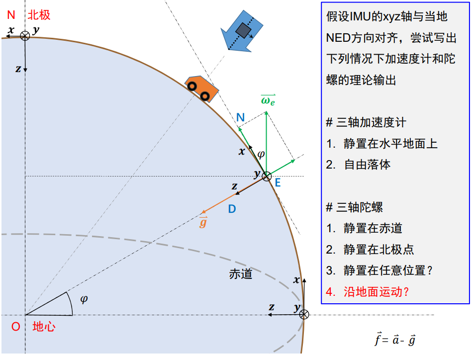

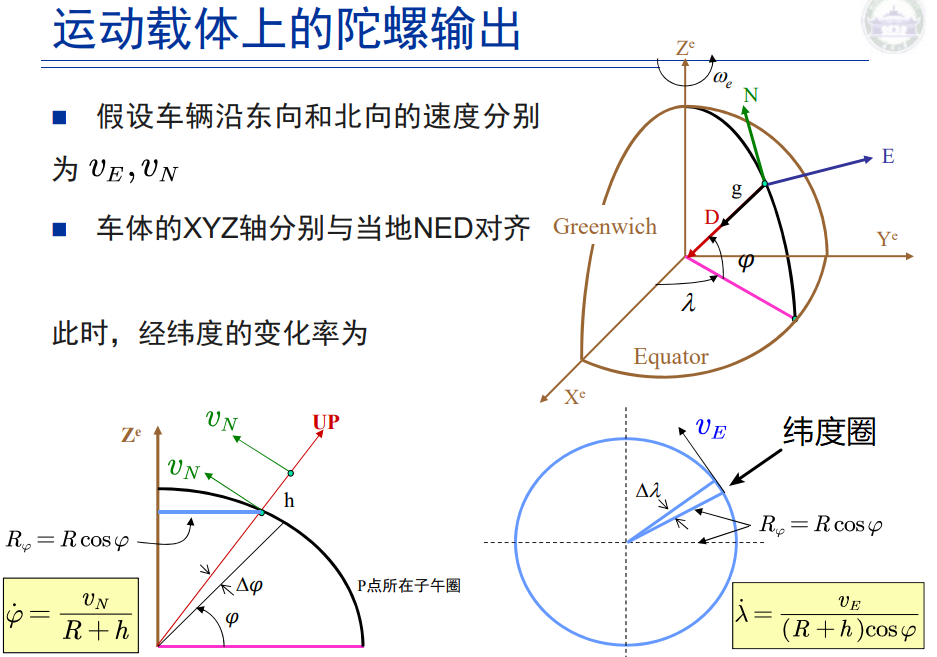

## 三轴加速度计

### 1.静置在水平地面上

$$
\vec f =
\left [ \begin{matrix}
0 \\
0 \\
0 \\
\end{matrix} \right ]  - 
\left [ \begin{matrix}
0 \\
0 \\
g \\
\end{matrix} \right] = 
\left [ \begin{matrix}
0 \\
0 \\
-g \\
\end{matrix} \right]
$$

### 2. 自由落体

$$
\vec f =
\left [ \begin{matrix}
0 \\
0 \\
g \\
\end{matrix} \right ]  - 
\left [ \begin{matrix}
0 \\
0 \\
g \\
\end{matrix} \right] = 
\left [ \begin{matrix}
0 \\
0 \\
0 \\
\end{matrix} \right]
$$

## 三轴陀螺

三轴陀螺想方向的时候不要忘记是用右手螺旋定理找出来的旋转轴。

### 1.静置在赤道上

$$
\vec \omega_{ie} = 
\left [ \begin{matrix}
+15°/h(地球自转，此时和x轴重合) \\
0 \\
0 \\
\end{matrix} \right ]
$$
### 2. 在北极点

$$
\vec \omega_{ie} = 
\left [ \begin{matrix}
0 \\
0 \\
-15°/h(此时和z轴方向相反) \\
\end{matrix} \right ]
$$

### 3. 在任意方向

$$
\vec \omega_{ie} = 
\left [ \begin{matrix}
+15°/h \times \cos \varphi \\
0 \\
+15°/h \times \sin \varphi \\
\end{matrix} \right ]
$$

### 4. 车辆沿地面运动（以向北为例）

$$
\vec \omega_{ie} = 
\left [ \begin{matrix}
+15°/h \times \cos \varphi \\
0 \\
+15°/h \times \sin \varphi \\
\end{matrix} \right ] +
\left [ \begin{matrix}
0 \\
-\frac{v_N}{R+h} \\
0 \\
\end{matrix} \right ]
$$
其中$v_N$为向北线速度。

### 5. 车辆沿地面运动（以向东为例）

向东时转轴和地球自转轴重合。角速率（经度变换率）为：

$$
\dot \lambda = \frac{v_E}{(R+h)\cos \varphi}
$$

$$
\vec \omega_{ie} = 
\left [ \begin{matrix}
+15°/h \times \cos \varphi \\
0 \\
+15°/h \times \sin \varphi \\
\end{matrix} \right ] +
\left [ \begin{matrix}
\frac{v_E}{R+h} \\
0 \\
- \frac{v_E}{R+h}\tan \varphi \\
\end{matrix} \right ]
$$

# 常用坐标系

## 实用惯性坐标系(i-frame)

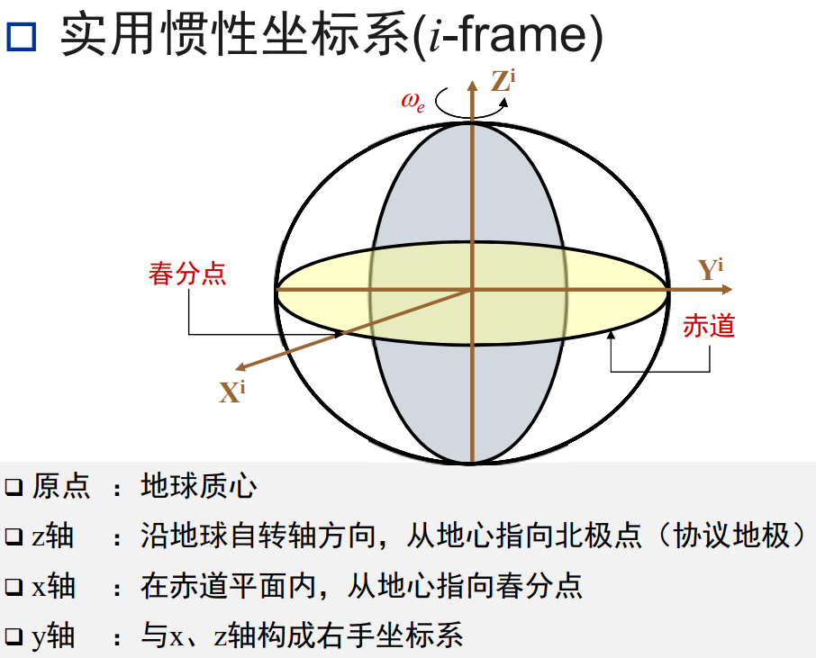

> Note:
> 1. 实用惯性坐标系不随地球自转
> 2. 春分点定义：
> 3. 地球上的点在i系上的坐标是时刻变化的

## 地心地固坐标系(e-frame)

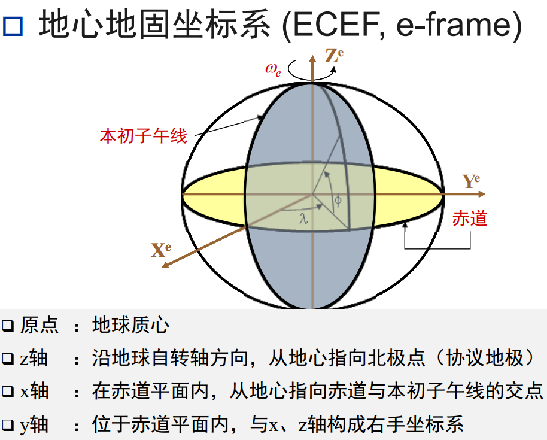

## 导航坐标系(n-frame)

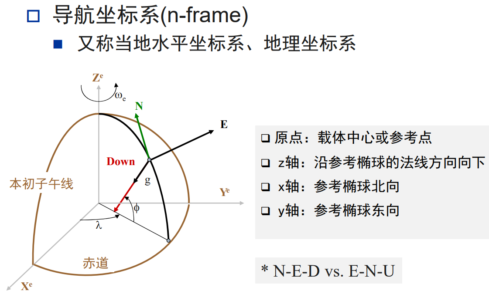

## IMU坐标系(b-frame)

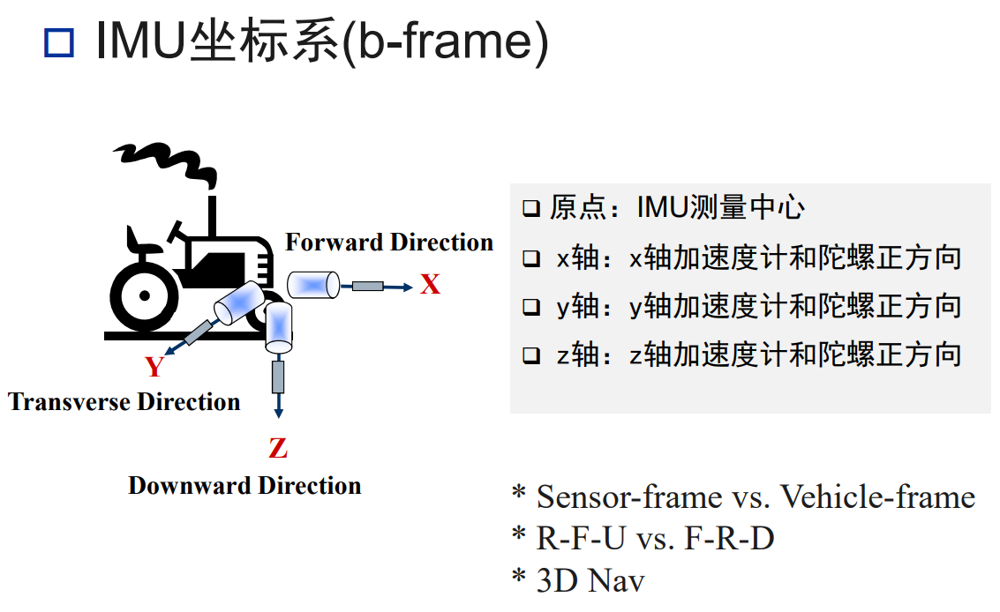

### 对应关系

| 导航坐标系 | 载体坐标系 |
| ---------- | --------- |
| 北东地     | 前右下    |
| 东北天     | 右前上    |

# 误差分类

## 静态误差(加性误差)

- 零偏(Bias)
	- 常值误差(Constant error)
	- 重复性(Repeatability)
	- 稳定性(Stability)
	- 噪声和带宽(Noise & Bandwidth)
	- 热敏感度(Thermal sensitivity, 温漂)
- 噪声(Noise)(**这一块需要重新听听P9**)
	- 高频误差，完全随机（相邻历元不相关）
	- 白噪声模型：功率谱密度在整个频域内均匀分布的噪声
	- 实际白噪声的带宽（**需要注意**）
	- 别名
		- angular random walk(ARW)(陀螺仪：角度)
		- velocity random walk(VRRW)(加速度计：速度)
	- 白噪声模型参数(**不太懂**)

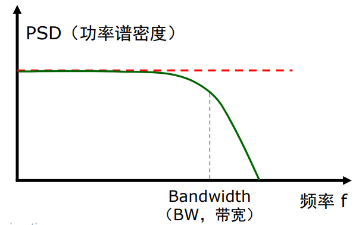

## 动态误差(乘性误差)

注：动态误差的影响一般比静态误差要小。

- 比例因子误差(Scale factor)
	- 输出被测量的信号 / 输入物理量
- 包含非线性(non-linearity)
	- 随输入信号变化的比例因子
- 轴偏移/轴交叉/交轴耦合(Axes misalignment/cross-axis)
	- 每个轴的输出受到其他两个轴的输入的影响

## 测量模型

注：这部分课程有剪切，所以需要找资料再看看。

### 陀螺

$$
\tilde{\boldsymbol{\omega}}=\boldsymbol{\omega}+\boldsymbol{b}_\omega+\mathbf{S} \boldsymbol{\omega}+\mathbf{N} \boldsymbol{\omega}+\boldsymbol{\varepsilon}_\omega
$$

- $\tilde{\boldsymbol{\omega}}$: 测量值($deg/hr$)
- $\omega$: 真实的角速度(deg/hr)
- $b_{\omega}$: 陀螺零偏(deg/hr)
- $S$:  陀螺比例因子误差矩阵
- $N$:  陀螺交轴耦合误差矩阵
- $\boldsymbol{\varepsilon}_\omega$:  陀螺传感器噪声矢量(deg/hr)

$$
\boldsymbol{b}_\omega=\left[\begin{array}{c}
b_{\omega, x} \\
b_{\omega, y} \\
b_{\omega, z}
\end{array}\right] \quad \mathbf{S}=\left[\begin{array}{ccc}
s_x & 0 & 0 \\
0 & s_y & 0 \\
0 & 0 & s_z
\end{array}\right] \quad \mathbf{N}=\left[\begin{array}{ccc}
0 & \gamma_{x y} & \gamma_{x z} \\
\gamma_{y x} & 0 & \gamma_{y z} \\
\gamma_{z x} & \gamma_{z y} & 0
\end{array}\right]
$$

### 加速度计

$$
\tilde{\boldsymbol{f}}=\boldsymbol{f}+\boldsymbol{b}_f+\mathbf{S}_1 \boldsymbol{f}+\mathbf{S}_2 \boldsymbol{f}^2+\mathbf{N} \boldsymbol{f}+\delta \boldsymbol{g}+\boldsymbol{\varepsilon}_f
$$

- $\tilde{\boldsymbol{f}}$  :  测量值($m/sec^2$)
- $f$  :  真实比力($m/sec^2$)
- $b_f$  :  加速度计零偏($m/sec^2$)
- $S_1$  :  线性比例因子误差矩阵
- $S_2$  :  非线性比例因子误差矩阵
- $N$  :  交轴耦合矩阵
- $\delta \boldsymbol{g}$  :  重力异常
- $\boldsymbol{\varepsilon}_f$  :  加速度计传感器噪声矢量($m/sec^2$)

## 一些易混淆的概念

**注：** 在购买器件的时候，指标的对比应该一致

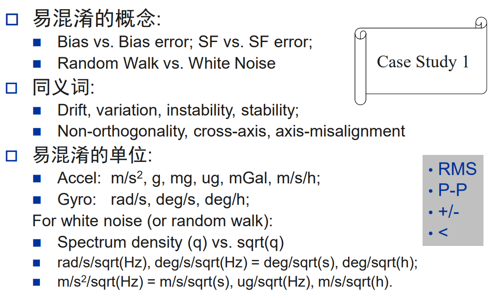

# 误差模型

## 误差模型的识别(⭐没听懂)

### Auto Correlation

#### 白噪声过程

#### 一阶马尔可夫过程

### 功率谱密度分析(PSD)

### Allan方差分析方法(在高中物理用过)

目标：找不同时间尺度上的稳定性

#### Allan方差曲线

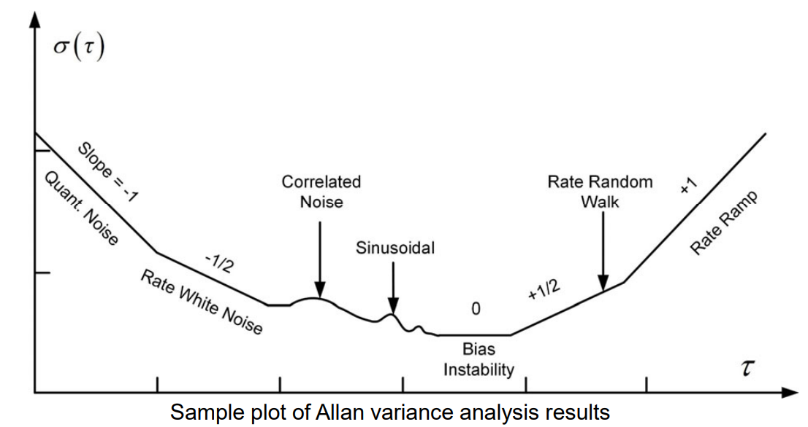

# 测试和标定

## IMU 的标定

### 加速度计的两位置法静态标定

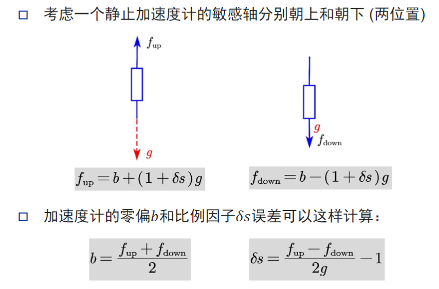

$f_{up}$的计算方式为：

因为加速度计的实际输出为

以加速度计方向为正方向，交轴耦合和噪声忽略不计，剩下前三项。其中f根据公式$\vec f = \vec a - \vec g$ ，其中$\vec a$ 为0，代入可得。$f_{down}$ 同理。

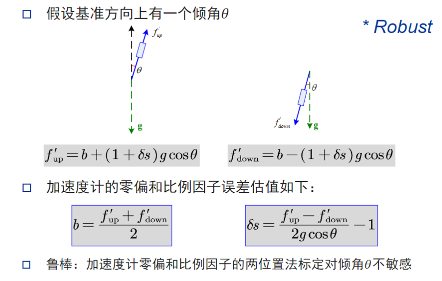

因为夹角$\theta$ 对结果影响较小，所以这个方法鲁棒性较好。

### 六位置法标定算法

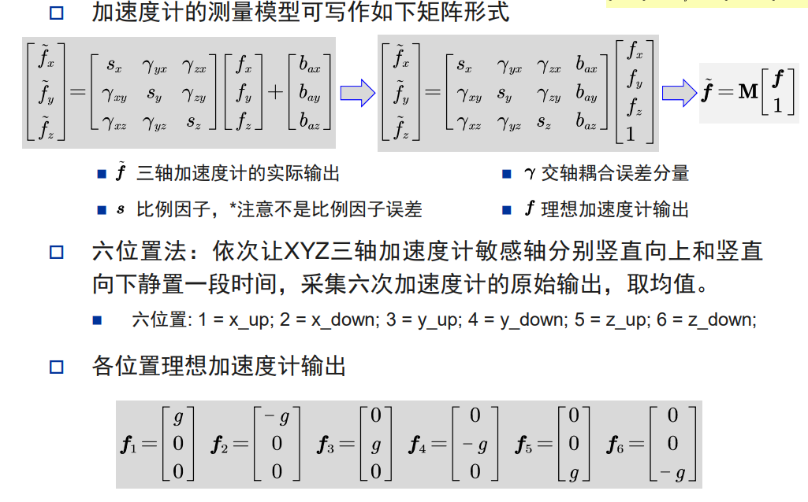

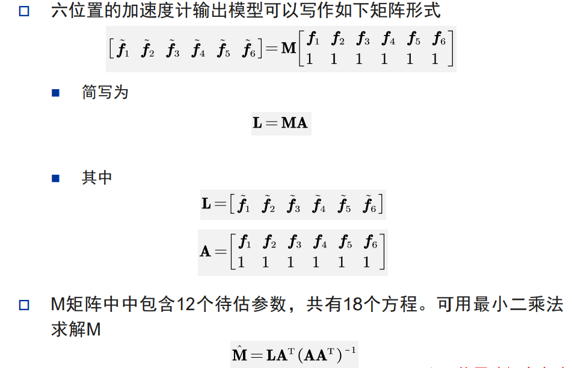

[最小二乘法](https://zhuanlan.zhihu.com/p/38128785) 解析

> 注：如果没有标准测量平台（实验室），可以使用十二位置法，简单来说就是一个轴换姿态（180度旋转）求两次，然后求平均作为六位置的一次测量结果。

## 陀螺标定原理

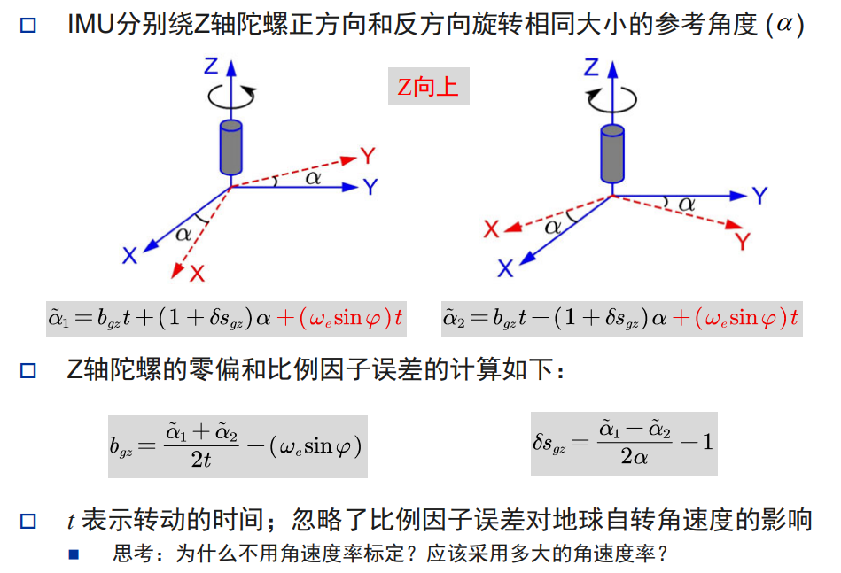

陀螺标定方法和加速度计标定方法类似，通过转台正转反转类比加速度计的正放反放。

这里需要注意的是通过角度进行标定（而陀螺测的是角速度）。原因是稳定角速度的转台制造成本过高。而通过对时间积分即可测出陀螺仪的旋转角度，此时和转台角度对比，即可得到标定结果。

## 一阶马尔可夫过程(⭐ 补充学习)

补充学习