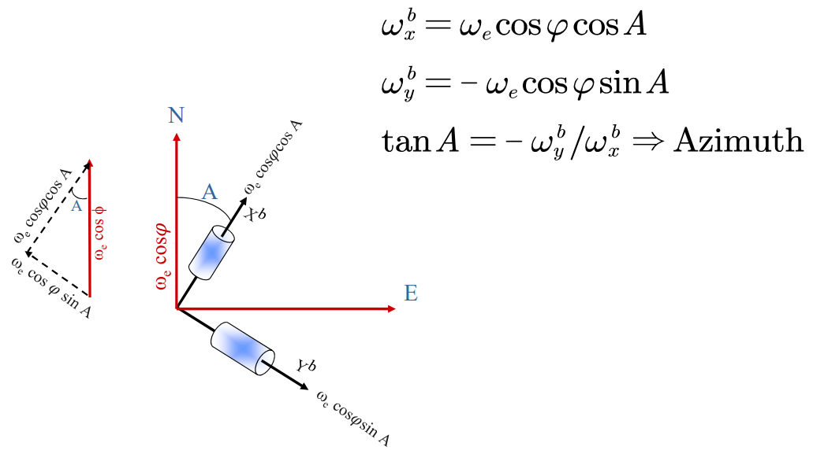

# 惯导初始化

- 初始位置：外界给定(GPS)
- 初始速度：0 或者外界给定
- 初始姿态：可以自己对准（很多地方相当于初始化）

## 姿态角定义

航向，俯仰，横滚

准确定义：[[2.1惯导机械编排算法#常用姿态角]]

# 静态粗对准

**问题**:粗对准是在干什么？是为了找水平垂直还是找载体坐标此时的角度？

## 加速度计调平

- 通过感应重力加速度找到水平(俯仰和横滚)

⭐ 需要去理解一下$\hat a_x$

## 陀螺罗盘

- 通过地球自转角速度找到航向(地球自转分解)

注：精度（误差）很重要，需要重要理解

## 基座对准的航向角精度取决于

- 陀螺（东向轴）零偏
- 纬度
- 陀螺角度随机游走
- 对准时间
- 加速度计调平精度
- 载体的晃动

# 初始对准的影响因素

# 双矢量定姿原理(⭐)

